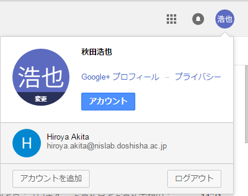

## メールアドレス初期設定

既に google アカウントを使用している場合は、そのアカウントに追加することで、Nislab のアカウントに簡単に接続することが可能です。  
下の図で言うと、左下の「アカウントを追加」から、追加が可能です。

## メーリングリストへメールを送信する場合

「`nis-all@nislab.doshisha.ac.jp`」を宛先としてメールを送信すると、グループのメンバー全員にメールが転送される。  
この仕組みをメーリングリストと呼ぶ。

## 注意事項

- 自分には送信されない  
  メーリングリストに送信したメールは自分には転送されないので注意！！
- 容量の大きいファイル（9M 以上）を添付した場合、エラーなしに全員に送信されていない可能性がある。  
  卒論や動画の入ったパワーポイントなど、サイズが大きいファイルを添付した場合、エラーのメールなしに、全員に転送されていない場合があるので注意！！  
  添付ファイルが 8M 以上の場合は，注意！！
