## 機種名

Canon iR-ADV C3720F（IP Adress: 172.20.69.34）

## ドライバのダウンロード

[Canon 公式サイト](https://www.google.com/url?q=https%3A%2F%2Fcweb.canon.jp%2Fcgi-bin%2Fdownload%2Fselect-product-by-catg.cgi%3Fi_cd_pr_catg%3D131&sa=D&sntz=1&usg=AFQjCNGi3ZNb1-_shsyOvCd87zNVpvX-3A) からドライバーをダウンロードしてくる

「オフィス向け複合機 > iR-ADV C3000 > iR-ADV C3720F」をクリック  
自分の環境にあったドライバーをダウンロードする

## Windows

1. ドライバのインストール

   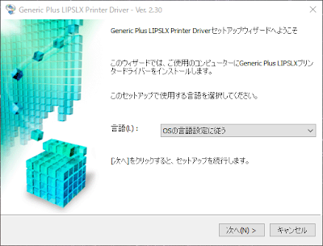

2. 標準セットアップを選択する

   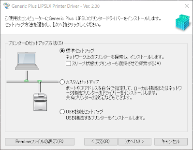

3. インストールするプリンタとして「IP アドレス：172.20.69.34」をチェックする

   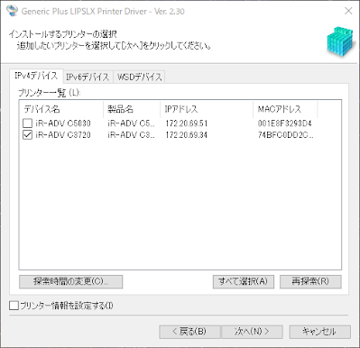

4. そのままインストールを進めればプリンタが追加され完了です

### 一覧にプリンターが表示されない場合

1. 標準セットアップでは上記 3.でプリンターが表示されない場合がある

   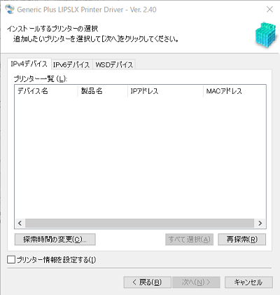

2. その場合はカスタムセットアップを選択する

   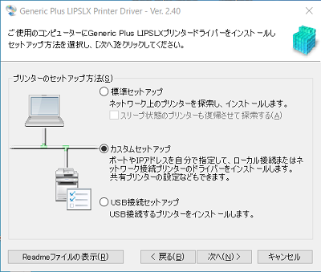

3. 自動構成を選択する

   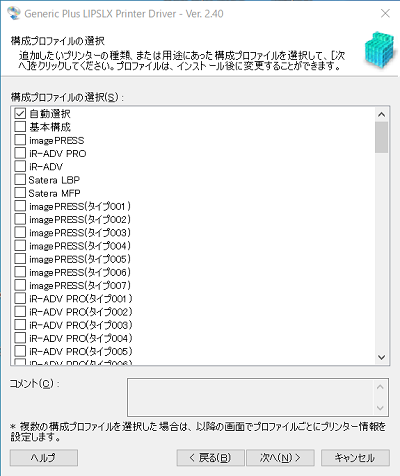

4. 使用するポートはプリンターのIPアドレス「172.20.69.34」を選択する

   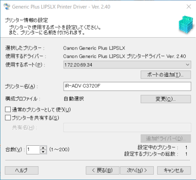

5. インストールを開始する

   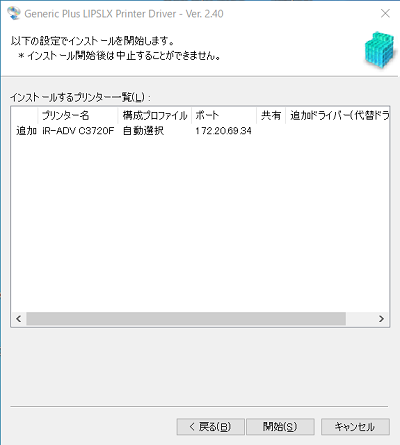

6. 終了したらPCを再起動する

## Mac OS

1. ドライバのインストール  
   「UFRII_LT_LIPS_LX_Installer.pkg」からドライバーをインストールする

   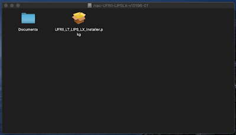

2. プリンタの追加  
   「システム環境設定 > プリンタとスキャナ」から左下のプラスボタンを押す

   - IP を選択する  
     左上のタブから IP を選択する

   - IP アドレスの入力
     「アドレス」に 172.20.69.34 を入力する

   - プロトコルの選択  
     「プロトコル」を LPD（Line Printer Daemon）を選択する

   - ドライバの選択  
     「ドライバ」をソフトウェアを選択を選択する

     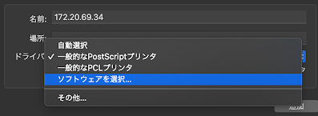

   - 「プリンタソフトウェア > 検索」から 3720 と検索し，「Canon iR-ADV C3720」を選択する

     

   これでプリンタの登録は完了です

3. オプションの設定
   「システム環境設定 > プリンタとスキャナ」から追加したプリンタを選択し，オプションとサプライをクリックする  
   「オプション」タブの「2 段カセットペディスタル」をオンにする

   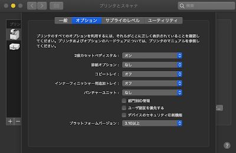

4. テストプリント
   「システム環境設定 > プリンタとスキャナ > .追加したプリンタを選択」からプリントキューを開くをクリックする  
   メニューバーの「プリンタ」からテストページをプリントをクリックすることでテストプリントが可能です
