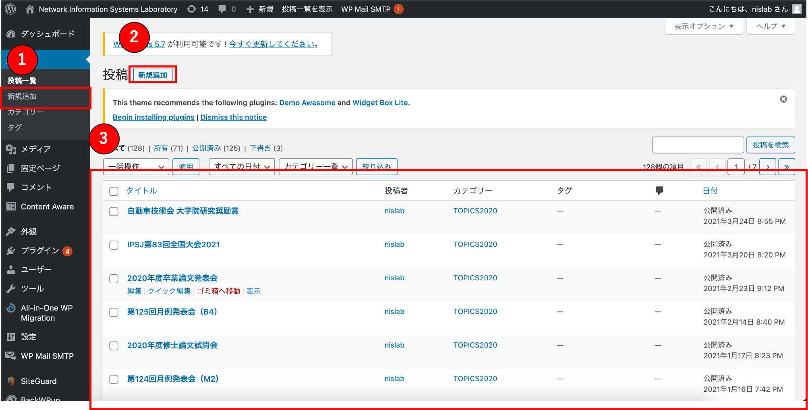
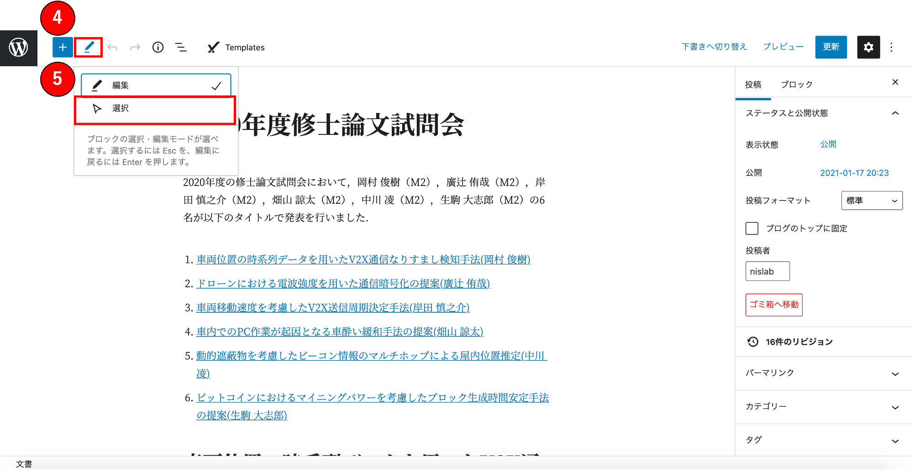
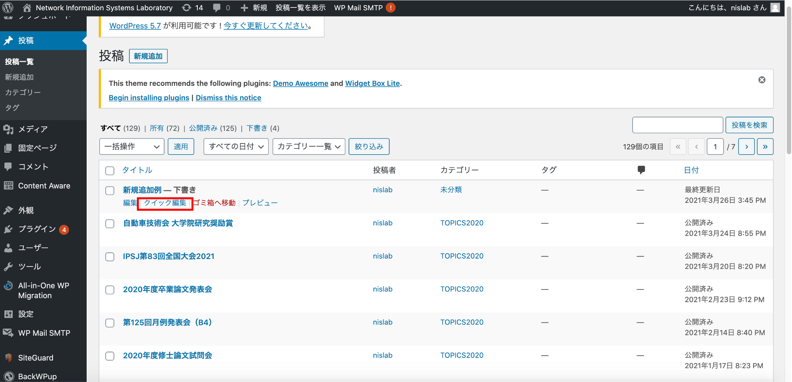
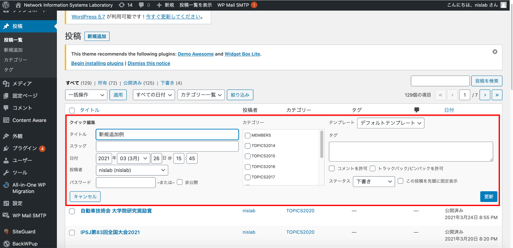
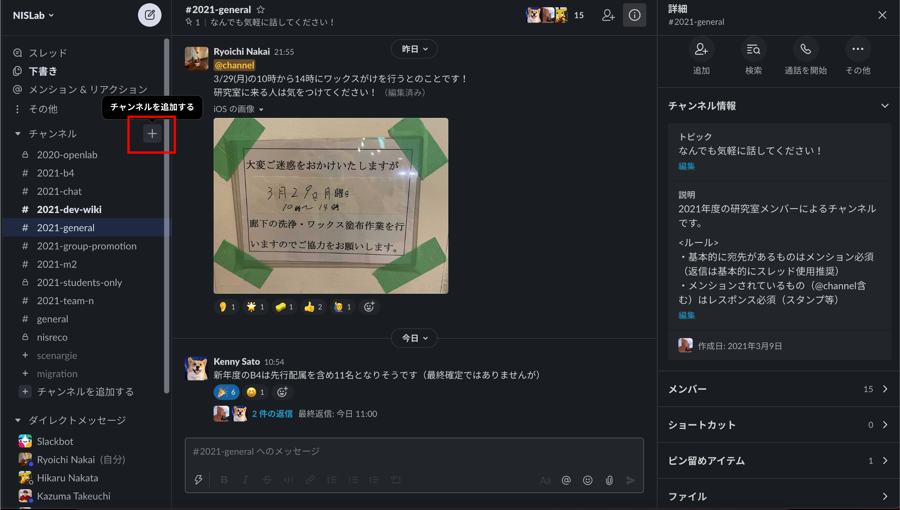
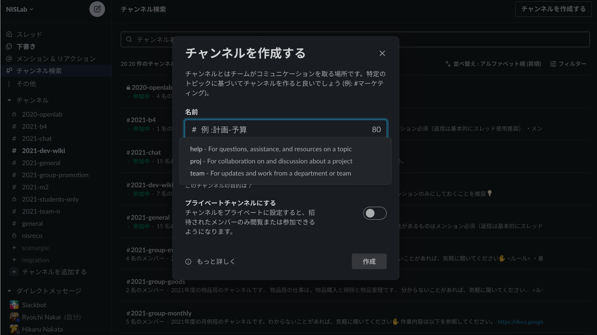
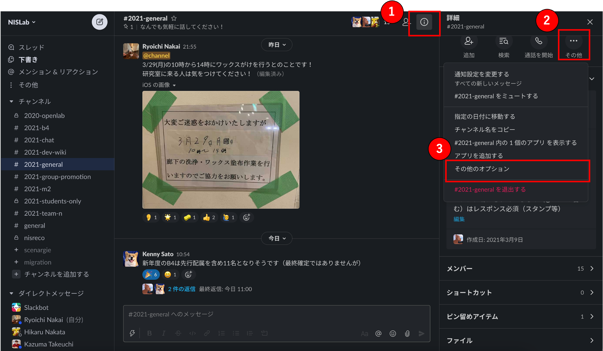
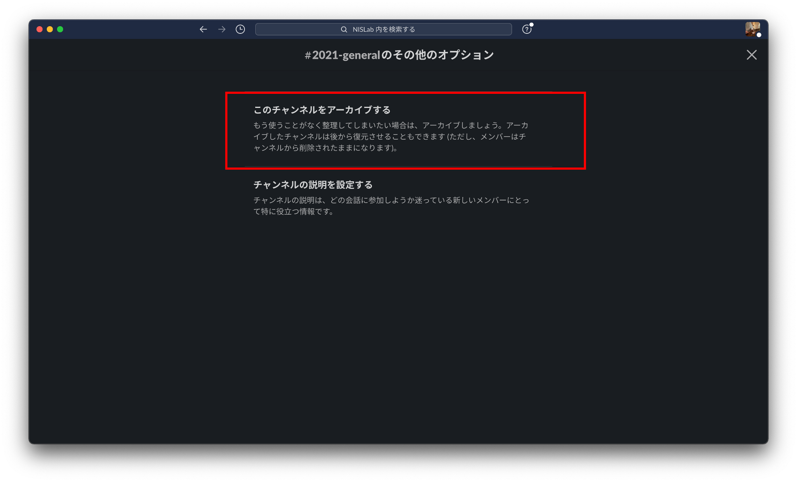
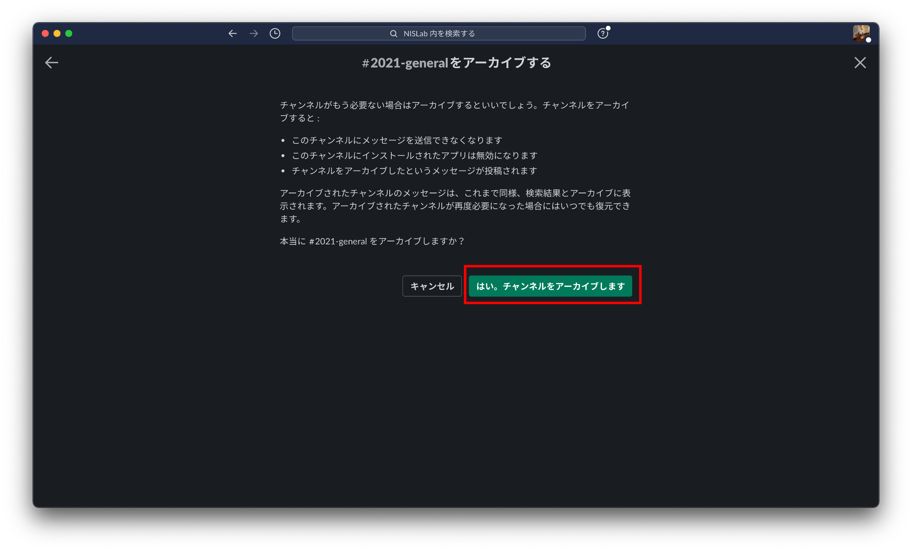

## 主な仕事

- 研究室サイトの更新・管理(WordPress)
- Slackのチャンネル管理

## 研究室サイトの更新・管理(WordPress)

[研究室サイトリンク](https://nislab.doshisha.ac.jp/)

研究室サイトの更新・管理にはWordPress使用します．
ここではその操作方法について説明していきます．

### 新規投稿

- ダッシュボードの1，もしくは2の新規追加をクリックする．
- 新規追加が完了し，新しいページが表示されたらダッシュボードに戻り，3の一覧の中から去年の記事のうち作成したい記事と同じものを探す．(例：「2021年度修士論文試問会」の記事を作成したい場合は「2020年度修士論文試問会」)

- 2で見つけた記事を開き，3のペンのマークをクリックし，4の選択をクリックする．
- Ctrl+Aで全てを選択し，1で新規作成した記事にコピー&ペーストを行う．

- 内容を編集し，完成させる．

### クイック編集

- 記事の作成が終わったらダッシュボードに戻り，作成した記事にカーソルを合わせ，クイック編集をクリックする．

- 日付を作成した記事の内容の出来事が起こった日に合わせる．
- カテゴリーの「TOPIC20xx」(xxは該当年度)にチェック．
- ステータスを「下書き」から「公開」に変更．
- 更新をクリック．

## Slackのチャンネル管理

研究室の情報伝達，交流に用いているSlackのチャンネル管理を行います．
ここではそのチャンネルの管理における操作方法について説明します．

### チャンネルの新規作成

- チャンネルの右の「+」ボタンをクリックする．
- 「チャンネルを作成する」をクリック．

- チャンネル名を入力する．チャンネル名は「20xx-名前」(xxは該当年度)とする．
- そのチャンネルを利用する．

### チャンネル削除時のアーカイブ保存

年度の変わり目など不必要となったチャンネルについては削除するのではなく，アーカイブとして保存を行います．
その手順について以下に示します．

- 1の「!」マークをクリック．
- 次に2の「その他」をクリック．
- 3の「その他のオプション」をクリック．

- 「このチャンネルをアーカイブする」をクリック．

- 「はい，チャンネルをアーカイブします」をクリック．

