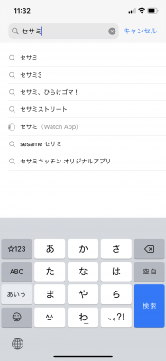
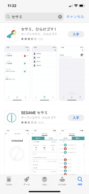
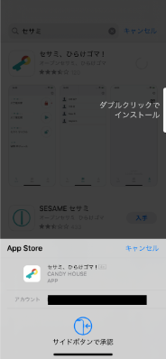
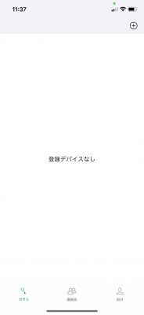
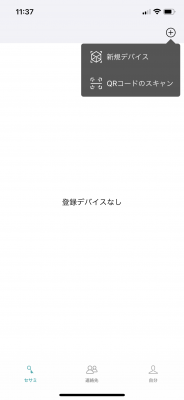
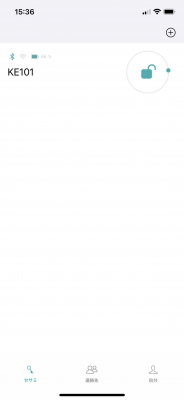
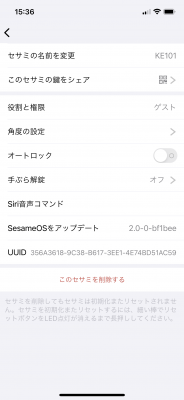
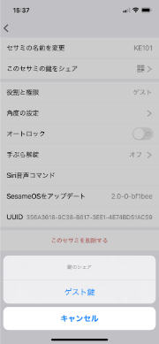
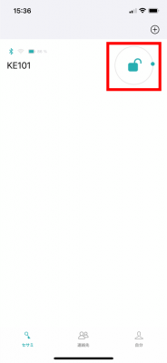

## セサミのインストール

画像はiOSのものなので，Androidの方は各自インストールしてください．

1. App StoreもしくはGoogle Playで「セサミ」と入力して検索

   

2. 「セサミ、ひらけゴマ！」から「入手」をタップ

   

3. インストールする

   

## 鍵を受け取る

1. アプリを開いて，「セサミ」タブをタップ

   

2. 右上の＋ボタンを押して，「QRコードのスキャン」をタップして鍵を持っている人のQRコードをスキャンする

   

## 鍵を渡す

1. 対象の鍵の項目をタップする

   

2. 「このセサミの鍵をシェア」をタップ

   

3. 「ゲスト鍵」（もしくはオーナー鍵）をタップするとQRコードが表示され，鍵を持っていない人に読み込んでもらう

   

## 鍵の解錠・施錠

- 赤い枠を押して，解錠・施錠を行う

   
